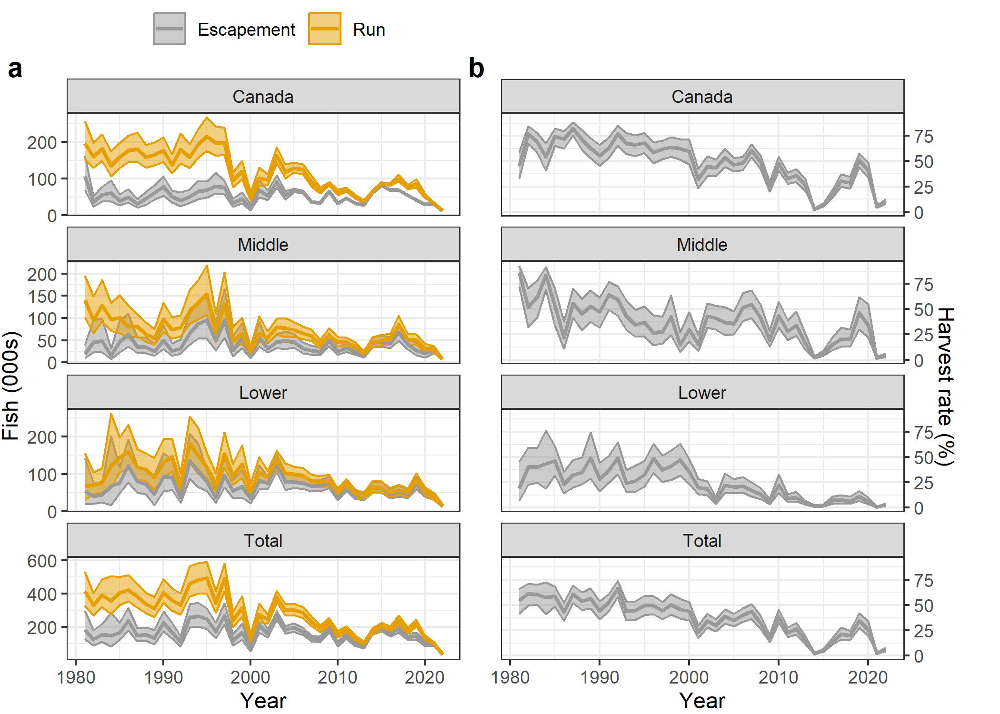
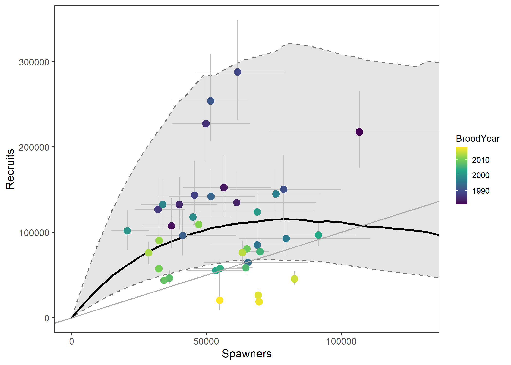
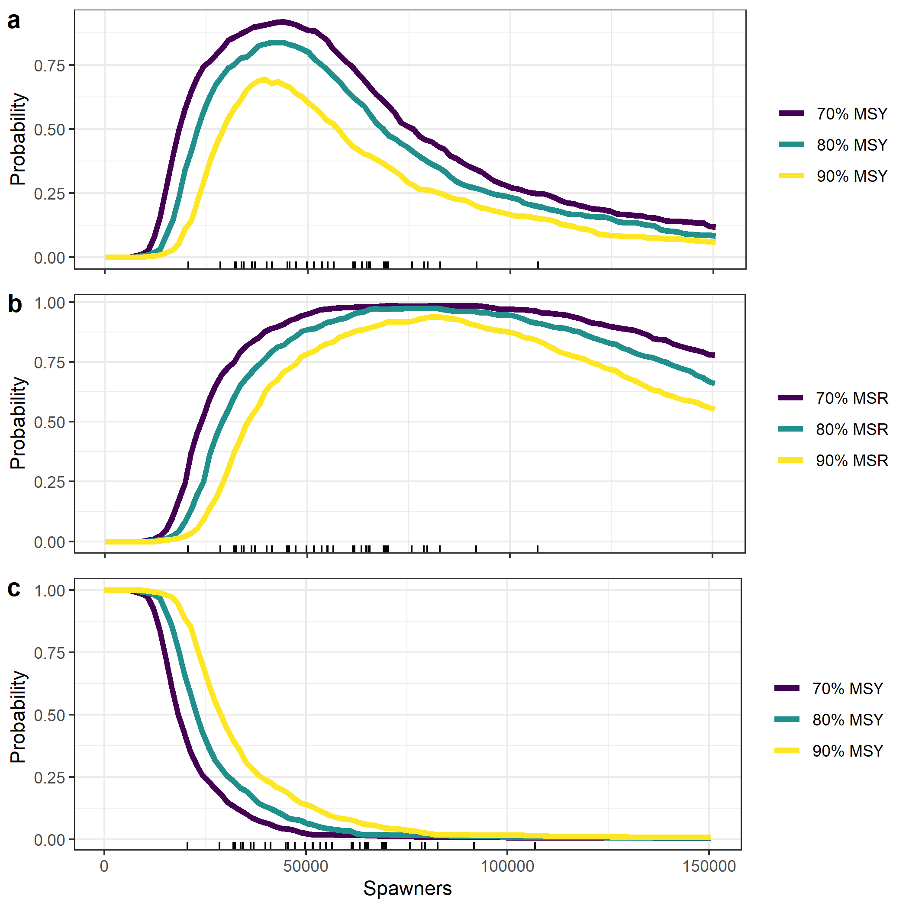

```{=html}
<style type="text/css">

body{ /* Normal  */
      font-size: 15px;
  }
td {  /* Table  */
  font-size: 14px;
}
h1.title {
  font-size: 24px;
  color: Black;
}
h1 { /* Header 1 */
  font-size: 19px;
  color: Black;
}
h2 { /* Header 2 */
    font-size: 16px;
  color: Black;
}
</style>
```
This document summarizes run-reconstructions for lower, middle, and upper (Canadian) Yukon River Chinook salmon (*Oncorhynchus tshawytscha*) stock aggregates as well as biological reference points for the Canadian stock. These estimates are based on a integrated state-space run reconstruction and spawner-recruitment model fit to data (1981-2022) from various assessment projects that estimate mainstem passage, harvests, tributary escapements, stock-proportions, and age-composition, under a single Bayesian estimation framework. 

Full model details and sensitivity analyses are described in: 

>Connors, B.M., Bradley C.A., Cunningham C., Hamazaki T., and Liller, Z.W. 2022. Estimates of biological reference points for the Canadian-origin Yukon River mainstem Chinook salmon (*Oncorhynchus tshawytscha*) stock aggregate. DFO Can. Sci. Advis. Sec. Res. Doc. 2022/031.iv + 100 p.

Repository with all data and code to reproduce data updates, model fitting, and this doc, can be found [here](https://github.com/Pacific-salmon-assess/yukon-imeg-model). 


# Figures

## Run-reconstructions



**Figure 1**. Reconstructed (a) harvest rates and (b) total run size and spawning escapements of Yukon River Chinook salmon by stock and combined. Thick lines are medians and shaded areas indicate 95% credible intervals.

## CDN-origin spawner-recruitment relationship



**Figure 2**. Spawner-recruitment relationship and productivity over time.(a) Relationship between recruitment and spawner abundance for Canadian-origin Yukon Chinook salmon from 1982 to 2019. Error bars and grey band are 95% credible intervals, thick black line is the expected relationship. (b) Approximate annual estimates of time-varying productivity (sum ln(a) and log residuals exponentiated) with 50th and 95th credible intervals dashed line at replacement.

## Probability profiles



**Figure 3**. Optimal probability profiles. (a) Optimal yield profile showing the probability that a given spawner abundance is expected to achieve 70%, 80%, or 90% of maximum sustainable yield (MSY). (b) Optimal recruitment profile showing the probability that a given spawner abundance is expected to achieve 70%, 80%, or 90% of maximum sustainable recruitment (S~MSR~). Historic spawning escapements are shown along x-axis. (c) Overfishing profile, calculated as 1 – P(SY > X% of MSY) at S < SMSY , and 0 at S > SMSY , showing the probability that sustained yield (SY) is reduced to less than a percentage (70%, 80%, or 90%) of MSY given a fixed level of escapement.


# Tables

## CDN run-reconstruction

**Table 1**. Reconstructed total run size, spawning escapements, harvest and harvest rates for the Canadian-origin Yukon River Chinook salmon stock. Shown are posterior medians. 

<table class="table table-striped table-hover" style="margin-left: auto; margin-right: auto;">
 <thead>
  <tr>
   <th style="text-align:center;"> Year </th>
   <th style="text-align:right;"> Total run </th>
   <th style="text-align:right;"> Escapement </th>
   <th style="text-align:center;"> Harvest </th>
   <th style="text-align:right;"> Harvest rate (%) </th>
  </tr>
 </thead>
<tbody>
  <tr>
   <td style="text-align:center;"> 1981 </td>
   <td style="text-align:right;"> 196895 </td>
   <td style="text-align:right;"> 106832 </td>
   <td style="text-align:center;"> 89543 </td>
   <td style="text-align:right;"> 46 </td>
  </tr>
  <tr>
   <td style="text-align:center;"> 1982 </td>
   <td style="text-align:right;"> 160516 </td>
   <td style="text-align:right;"> 37046 </td>
   <td style="text-align:center;"> 123059 </td>
   <td style="text-align:right;"> 77 </td>
  </tr>
  <tr>
   <td style="text-align:center;"> 1983 </td>
   <td style="text-align:right;"> 182085 </td>
   <td style="text-align:right;"> 56453 </td>
   <td style="text-align:center;"> 124035 </td>
   <td style="text-align:right;"> 69 </td>
  </tr>
  <tr>
   <td style="text-align:center;"> 1984 </td>
   <td style="text-align:right;"> 135823 </td>
   <td style="text-align:right;"> 61250 </td>
   <td style="text-align:center;"> 72975 </td>
   <td style="text-align:right;"> 54 </td>
  </tr>
  <tr>
   <td style="text-align:center;"> 1985 </td>
   <td style="text-align:right;"> 158529 </td>
   <td style="text-align:right;"> 39945 </td>
   <td style="text-align:center;"> 117779 </td>
   <td style="text-align:right;"> 75 </td>
  </tr>
  <tr>
   <td style="text-align:center;"> 1986 </td>
   <td style="text-align:right;"> 177207 </td>
   <td style="text-align:right;"> 49816 </td>
   <td style="text-align:center;"> 126806 </td>
   <td style="text-align:right;"> 72 </td>
  </tr>
  <tr>
   <td style="text-align:center;"> 1987 </td>
   <td style="text-align:right;"> 180604 </td>
   <td style="text-align:right;"> 31970 </td>
   <td style="text-align:center;"> 148318 </td>
   <td style="text-align:right;"> 82 </td>
  </tr>
  <tr>
   <td style="text-align:center;"> 1988 </td>
   <td style="text-align:right;"> 159149 </td>
   <td style="text-align:right;"> 45517 </td>
   <td style="text-align:center;"> 113010 </td>
   <td style="text-align:right;"> 71 </td>
  </tr>
  <tr>
   <td style="text-align:center;"> 1989 </td>
   <td style="text-align:right;"> 165103 </td>
   <td style="text-align:right;"> 61665 </td>
   <td style="text-align:center;"> 102365 </td>
   <td style="text-align:right;"> 63 </td>
  </tr>
  <tr>
   <td style="text-align:center;"> 1990 </td>
   <td style="text-align:right;"> 177462 </td>
   <td style="text-align:right;"> 78731 </td>
   <td style="text-align:center;"> 98298 </td>
   <td style="text-align:right;"> 55 </td>
  </tr>
  <tr>
   <td style="text-align:center;"> 1991 </td>
   <td style="text-align:right;"> 138870 </td>
   <td style="text-align:right;"> 51588 </td>
   <td style="text-align:center;"> 87048 </td>
   <td style="text-align:right;"> 63 </td>
  </tr>
  <tr>
   <td style="text-align:center;"> 1992 </td>
   <td style="text-align:right;"> 179935 </td>
   <td style="text-align:right;"> 41234 </td>
   <td style="text-align:center;"> 136042 </td>
   <td style="text-align:right;"> 77 </td>
  </tr>
  <tr>
   <td style="text-align:center;"> 1993 </td>
   <td style="text-align:right;"> 158647 </td>
   <td style="text-align:right;"> 51684 </td>
   <td style="text-align:center;"> 105899 </td>
   <td style="text-align:right;"> 68 </td>
  </tr>
  <tr>
   <td style="text-align:center;"> 1994 </td>
   <td style="text-align:right;"> 194196 </td>
   <td style="text-align:right;"> 65436 </td>
   <td style="text-align:center;"> 126707 </td>
   <td style="text-align:right;"> 66 </td>
  </tr>
  <tr>
   <td style="text-align:center;"> 1995 </td>
   <td style="text-align:right;"> 216057 </td>
   <td style="text-align:right;"> 68815 </td>
   <td style="text-align:center;"> 147284 </td>
   <td style="text-align:right;"> 68 </td>
  </tr>
  <tr>
   <td style="text-align:center;"> 1996 </td>
   <td style="text-align:right;"> 197529 </td>
   <td style="text-align:right;"> 79581 </td>
   <td style="text-align:center;"> 115911 </td>
   <td style="text-align:right;"> 59 </td>
  </tr>
  <tr>
   <td style="text-align:center;"> 1997 </td>
   <td style="text-align:right;"> 198617 </td>
   <td style="text-align:right;"> 75780 </td>
   <td style="text-align:center;"> 122356 </td>
   <td style="text-align:right;"> 62 </td>
  </tr>
  <tr>
   <td style="text-align:center;"> 1998 </td>
   <td style="text-align:right;"> 94956 </td>
   <td style="text-align:right;"> 33771 </td>
   <td style="text-align:center;"> 60612 </td>
   <td style="text-align:right;"> 64 </td>
  </tr>
  <tr>
   <td style="text-align:center;"> 1999 </td>
   <td style="text-align:right;"> 120364 </td>
   <td style="text-align:right;"> 45012 </td>
   <td style="text-align:center;"> 74740 </td>
   <td style="text-align:right;"> 62 </td>
  </tr>
  <tr>
   <td style="text-align:center;"> 2000 </td>
   <td style="text-align:right;"> 51318 </td>
   <td style="text-align:right;"> 20553 </td>
   <td style="text-align:center;"> 30503 </td>
   <td style="text-align:right;"> 60 </td>
  </tr>
  <tr>
   <td style="text-align:center;"> 2001 </td>
   <td style="text-align:right;"> 101308 </td>
   <td style="text-align:right;"> 68826 </td>
   <td style="text-align:center;"> 32560 </td>
   <td style="text-align:right;"> 32 </td>
  </tr>
  <tr>
   <td style="text-align:center;"> 2002 </td>
   <td style="text-align:right;"> 97152 </td>
   <td style="text-align:right;"> 53525 </td>
   <td style="text-align:center;"> 43217 </td>
   <td style="text-align:right;"> 45 </td>
  </tr>
  <tr>
   <td style="text-align:center;"> 2003 </td>
   <td style="text-align:right;"> 163212 </td>
   <td style="text-align:right;"> 91669 </td>
   <td style="text-align:center;"> 71274 </td>
   <td style="text-align:right;"> 44 </td>
  </tr>
  <tr>
   <td style="text-align:center;"> 2004 </td>
   <td style="text-align:right;"> 118505 </td>
   <td style="text-align:right;"> 54996 </td>
   <td style="text-align:center;"> 62906 </td>
   <td style="text-align:right;"> 53 </td>
  </tr>
  <tr>
   <td style="text-align:center;"> 2005 </td>
   <td style="text-align:right;"> 129682 </td>
   <td style="text-align:right;"> 69907 </td>
   <td style="text-align:center;"> 60023 </td>
   <td style="text-align:right;"> 46 </td>
  </tr>
  <tr>
   <td style="text-align:center;"> 2006 </td>
   <td style="text-align:right;"> 124620 </td>
   <td style="text-align:right;"> 64570 </td>
   <td style="text-align:center;"> 60167 </td>
   <td style="text-align:right;"> 48 </td>
  </tr>
  <tr>
   <td style="text-align:center;"> 2007 </td>
   <td style="text-align:right;"> 91624 </td>
   <td style="text-align:right;"> 36243 </td>
   <td style="text-align:center;"> 55116 </td>
   <td style="text-align:right;"> 60 </td>
  </tr>
  <tr>
   <td style="text-align:center;"> 2008 </td>
   <td style="text-align:right;"> 67499 </td>
   <td style="text-align:right;"> 34275 </td>
   <td style="text-align:center;"> 33241 </td>
   <td style="text-align:right;"> 49 </td>
  </tr>
  <tr>
   <td style="text-align:center;"> 2009 </td>
   <td style="text-align:right;"> 86287 </td>
   <td style="text-align:right;"> 65074 </td>
   <td style="text-align:center;"> 21430 </td>
   <td style="text-align:right;"> 25 </td>
  </tr>
  <tr>
   <td style="text-align:center;"> 2010 </td>
   <td style="text-align:right;"> 61640 </td>
   <td style="text-align:right;"> 32302 </td>
   <td style="text-align:center;"> 29383 </td>
   <td style="text-align:right;"> 48 </td>
  </tr>
  <tr>
   <td style="text-align:center;"> 2011 </td>
   <td style="text-align:right;"> 70217 </td>
   <td style="text-align:right;"> 47162 </td>
   <td style="text-align:center;"> 23153 </td>
   <td style="text-align:right;"> 33 </td>
  </tr>
  <tr>
   <td style="text-align:center;"> 2012 </td>
   <td style="text-align:right;"> 50676 </td>
   <td style="text-align:right;"> 32429 </td>
   <td style="text-align:center;"> 18304 </td>
   <td style="text-align:right;"> 36 </td>
  </tr>
  <tr>
   <td style="text-align:center;"> 2013 </td>
   <td style="text-align:right;"> 38526 </td>
   <td style="text-align:right;"> 28535 </td>
   <td style="text-align:center;"> 10034 </td>
   <td style="text-align:right;"> 26 </td>
  </tr>
  <tr>
   <td style="text-align:center;"> 2014 </td>
   <td style="text-align:right;"> 65107 </td>
   <td style="text-align:right;"> 63363 </td>
   <td style="text-align:center;"> 1712 </td>
   <td style="text-align:right;"> 3 </td>
  </tr>
  <tr>
   <td style="text-align:center;"> 2015 </td>
   <td style="text-align:right;"> 88816 </td>
   <td style="text-align:right;"> 82675 </td>
   <td style="text-align:center;"> 6153 </td>
   <td style="text-align:right;"> 7 </td>
  </tr>
  <tr>
   <td style="text-align:center;"> 2016 </td>
   <td style="text-align:right;"> 83974 </td>
   <td style="text-align:right;"> 69192 </td>
   <td style="text-align:center;"> 14819 </td>
   <td style="text-align:right;"> 18 </td>
  </tr>
  <tr>
   <td style="text-align:center;"> 2017 </td>
   <td style="text-align:right;"> 99819 </td>
   <td style="text-align:right;"> 69619 </td>
   <td style="text-align:center;"> 30137 </td>
   <td style="text-align:right;"> 30 </td>
  </tr>
  <tr>
   <td style="text-align:center;"> 2018 </td>
   <td style="text-align:right;"> 76652 </td>
   <td style="text-align:right;"> 54920 </td>
   <td style="text-align:center;"> 21769 </td>
   <td style="text-align:right;"> 28 </td>
  </tr>
  <tr>
   <td style="text-align:center;"> 2019 </td>
   <td style="text-align:right;"> 86560 </td>
   <td style="text-align:right;"> 42296 </td>
   <td style="text-align:center;"> 44445 </td>
   <td style="text-align:right;"> 51 </td>
  </tr>
  <tr>
   <td style="text-align:center;"> 2020 </td>
   <td style="text-align:right;"> 52060 </td>
   <td style="text-align:right;"> 30918 </td>
   <td style="text-align:center;"> 21221 </td>
   <td style="text-align:right;"> 41 </td>
  </tr>
  <tr>
   <td style="text-align:center;"> 2021 </td>
   <td style="text-align:right;"> 33243 </td>
   <td style="text-align:right;"> 31528 </td>
   <td style="text-align:center;"> 1718 </td>
   <td style="text-align:right;"> 5 </td>
  </tr>
  <tr>
   <td style="text-align:center;"> 2022 </td>
   <td style="text-align:right;"> 13349 </td>
   <td style="text-align:right;"> 12008 </td>
   <td style="text-align:center;"> 1333 </td>
   <td style="text-align:right;"> 10 </td>
  </tr>
</tbody>
</table>

## Lower Yukon River run-reconstruction

**Table 2**. Reconstructed total run size, spawning escapements, harvest and harvest rates for the lower Yukon River Chinook salmon stock. Shown are posterior medians. 

<table class="table table-striped table-hover" style="margin-left: auto; margin-right: auto;">
 <thead>
  <tr>
   <th style="text-align:center;"> Year </th>
   <th style="text-align:right;"> Total run </th>
   <th style="text-align:right;"> Escapement </th>
   <th style="text-align:center;"> Harvest </th>
   <th style="text-align:right;"> Harvest rate (%) </th>
  </tr>
 </thead>
<tbody>
  <tr>
   <td style="text-align:center;"> 1981 </td>
   <td style="text-align:right;"> 68234 </td>
   <td style="text-align:right;"> 54061 </td>
   <td style="text-align:center;"> 12916 </td>
   <td style="text-align:right;"> 19 </td>
  </tr>
  <tr>
   <td style="text-align:center;"> 1982 </td>
   <td style="text-align:right;"> 70142 </td>
   <td style="text-align:right;"> 41369 </td>
   <td style="text-align:center;"> 27652 </td>
   <td style="text-align:right;"> 40 </td>
  </tr>
  <tr>
   <td style="text-align:center;"> 1983 </td>
   <td style="text-align:right;"> 76782 </td>
   <td style="text-align:right;"> 45307 </td>
   <td style="text-align:center;"> 30886 </td>
   <td style="text-align:right;"> 40 </td>
  </tr>
  <tr>
   <td style="text-align:center;"> 1984 </td>
   <td style="text-align:right;"> 121352 </td>
   <td style="text-align:right;"> 67631 </td>
   <td style="text-align:center;"> 51538 </td>
   <td style="text-align:right;"> 43 </td>
  </tr>
  <tr>
   <td style="text-align:center;"> 1985 </td>
   <td style="text-align:right;"> 143718 </td>
   <td style="text-align:right;"> 76673 </td>
   <td style="text-align:center;"> 66004 </td>
   <td style="text-align:right;"> 46 </td>
  </tr>
  <tr>
   <td style="text-align:center;"> 1986 </td>
   <td style="text-align:right;"> 160001 </td>
   <td style="text-align:right;"> 122923 </td>
   <td style="text-align:center;"> 36605 </td>
   <td style="text-align:right;"> 23 </td>
  </tr>
  <tr>
   <td style="text-align:center;"> 1987 </td>
   <td style="text-align:right;"> 119414 </td>
   <td style="text-align:right;"> 80207 </td>
   <td style="text-align:center;"> 38166 </td>
   <td style="text-align:right;"> 32 </td>
  </tr>
  <tr>
   <td style="text-align:center;"> 1988 </td>
   <td style="text-align:right;"> 112944 </td>
   <td style="text-align:right;"> 72493 </td>
   <td style="text-align:center;"> 39168 </td>
   <td style="text-align:right;"> 35 </td>
  </tr>
  <tr>
   <td style="text-align:center;"> 1989 </td>
   <td style="text-align:right;"> 91461 </td>
   <td style="text-align:right;"> 46661 </td>
   <td style="text-align:center;"> 44169 </td>
   <td style="text-align:right;"> 49 </td>
  </tr>
  <tr>
   <td style="text-align:center;"> 1990 </td>
   <td style="text-align:right;"> 131609 </td>
   <td style="text-align:right;"> 93524 </td>
   <td style="text-align:center;"> 36772 </td>
   <td style="text-align:right;"> 28 </td>
  </tr>
  <tr>
   <td style="text-align:center;"> 1991 </td>
   <td style="text-align:right;"> 145344 </td>
   <td style="text-align:right;"> 90612 </td>
   <td style="text-align:center;"> 53109 </td>
   <td style="text-align:right;"> 37 </td>
  </tr>
  <tr>
   <td style="text-align:center;"> 1992 </td>
   <td style="text-align:right;"> 73293 </td>
   <td style="text-align:right;"> 36903 </td>
   <td style="text-align:center;"> 35324 </td>
   <td style="text-align:right;"> 49 </td>
  </tr>
  <tr>
   <td style="text-align:center;"> 1993 </td>
   <td style="text-align:right;"> 180653 </td>
   <td style="text-align:right;"> 135914 </td>
   <td style="text-align:center;"> 43419 </td>
   <td style="text-align:right;"> 24 </td>
  </tr>
  <tr>
   <td style="text-align:center;"> 1994 </td>
   <td style="text-align:right;"> 149549 </td>
   <td style="text-align:right;"> 108853 </td>
   <td style="text-align:center;"> 39274 </td>
   <td style="text-align:right;"> 27 </td>
  </tr>
  <tr>
   <td style="text-align:center;"> 1995 </td>
   <td style="text-align:right;"> 118789 </td>
   <td style="text-align:right;"> 79811 </td>
   <td style="text-align:center;"> 38520 </td>
   <td style="text-align:right;"> 33 </td>
  </tr>
  <tr>
   <td style="text-align:center;"> 1996 </td>
   <td style="text-align:right;"> 74097 </td>
   <td style="text-align:right;"> 37815 </td>
   <td style="text-align:center;"> 35876 </td>
   <td style="text-align:right;"> 48 </td>
  </tr>
  <tr>
   <td style="text-align:center;"> 1997 </td>
   <td style="text-align:right;"> 154946 </td>
   <td style="text-align:right;"> 96340 </td>
   <td style="text-align:center;"> 57107 </td>
   <td style="text-align:right;"> 37 </td>
  </tr>
  <tr>
   <td style="text-align:center;"> 1998 </td>
   <td style="text-align:right;"> 96051 </td>
   <td style="text-align:right;"> 55816 </td>
   <td style="text-align:center;"> 39439 </td>
   <td style="text-align:right;"> 41 </td>
  </tr>
  <tr>
   <td style="text-align:center;"> 1999 </td>
   <td style="text-align:right;"> 126953 </td>
   <td style="text-align:right;"> 66182 </td>
   <td style="text-align:center;"> 59563 </td>
   <td style="text-align:right;"> 47 </td>
  </tr>
  <tr>
   <td style="text-align:center;"> 2000 </td>
   <td style="text-align:right;"> 53998 </td>
   <td style="text-align:right;"> 34645 </td>
   <td style="text-align:center;"> 19052 </td>
   <td style="text-align:right;"> 36 </td>
  </tr>
  <tr>
   <td style="text-align:center;"> 2001 </td>
   <td style="text-align:right;"> 104093 </td>
   <td style="text-align:right;"> 83313 </td>
   <td style="text-align:center;"> 20850 </td>
   <td style="text-align:right;"> 20 </td>
  </tr>
  <tr>
   <td style="text-align:center;"> 2002 </td>
   <td style="text-align:right;"> 91971 </td>
   <td style="text-align:right;"> 75080 </td>
   <td style="text-align:center;"> 16861 </td>
   <td style="text-align:right;"> 18 </td>
  </tr>
  <tr>
   <td style="text-align:center;"> 2003 </td>
   <td style="text-align:right;"> 138305 </td>
   <td style="text-align:right;"> 129385 </td>
   <td style="text-align:center;"> 8633 </td>
   <td style="text-align:right;"> 6 </td>
  </tr>
  <tr>
   <td style="text-align:center;"> 2004 </td>
   <td style="text-align:right;"> 102806 </td>
   <td style="text-align:right;"> 79815 </td>
   <td style="text-align:center;"> 23485 </td>
   <td style="text-align:right;"> 23 </td>
  </tr>
  <tr>
   <td style="text-align:center;"> 2005 </td>
   <td style="text-align:right;"> 100263 </td>
   <td style="text-align:right;"> 79621 </td>
   <td style="text-align:center;"> 20352 </td>
   <td style="text-align:right;"> 20 </td>
  </tr>
  <tr>
   <td style="text-align:center;"> 2006 </td>
   <td style="text-align:right;"> 95709 </td>
   <td style="text-align:right;"> 75213 </td>
   <td style="text-align:center;"> 20434 </td>
   <td style="text-align:right;"> 21 </td>
  </tr>
  <tr>
   <td style="text-align:center;"> 2007 </td>
   <td style="text-align:right;"> 81372 </td>
   <td style="text-align:right;"> 67331 </td>
   <td style="text-align:center;"> 13843 </td>
   <td style="text-align:right;"> 17 </td>
  </tr>
  <tr>
   <td style="text-align:center;"> 2008 </td>
   <td style="text-align:right;"> 79359 </td>
   <td style="text-align:right;"> 68792 </td>
   <td style="text-align:center;"> 10565 </td>
   <td style="text-align:right;"> 13 </td>
  </tr>
  <tr>
   <td style="text-align:center;"> 2009 </td>
   <td style="text-align:right;"> 82081 </td>
   <td style="text-align:right;"> 77173 </td>
   <td style="text-align:center;"> 4658 </td>
   <td style="text-align:right;"> 6 </td>
  </tr>
  <tr>
   <td style="text-align:center;"> 2010 </td>
   <td style="text-align:right;"> 50008 </td>
   <td style="text-align:right;"> 38812 </td>
   <td style="text-align:center;"> 11287 </td>
   <td style="text-align:right;"> 23 </td>
  </tr>
  <tr>
   <td style="text-align:center;"> 2011 </td>
   <td style="text-align:right;"> 73458 </td>
   <td style="text-align:right;"> 66586 </td>
   <td style="text-align:center;"> 6631 </td>
   <td style="text-align:right;"> 9 </td>
  </tr>
  <tr>
   <td style="text-align:center;"> 2012 </td>
   <td style="text-align:right;"> 46901 </td>
   <td style="text-align:right;"> 41970 </td>
   <td style="text-align:center;"> 4823 </td>
   <td style="text-align:right;"> 10 </td>
  </tr>
  <tr>
   <td style="text-align:center;"> 2013 </td>
   <td style="text-align:right;"> 41487 </td>
   <td style="text-align:right;"> 39526 </td>
   <td style="text-align:center;"> 1906 </td>
   <td style="text-align:right;"> 5 </td>
  </tr>
  <tr>
   <td style="text-align:center;"> 2014 </td>
   <td style="text-align:right;"> 64699 </td>
   <td style="text-align:right;"> 63567 </td>
   <td style="text-align:center;"> 1090 </td>
   <td style="text-align:right;"> 2 </td>
  </tr>
  <tr>
   <td style="text-align:center;"> 2015 </td>
   <td style="text-align:right;"> 64482 </td>
   <td style="text-align:right;"> 63068 </td>
   <td style="text-align:center;"> 1336 </td>
   <td style="text-align:right;"> 2 </td>
  </tr>
  <tr>
   <td style="text-align:center;"> 2016 </td>
   <td style="text-align:right;"> 49973 </td>
   <td style="text-align:right;"> 46447 </td>
   <td style="text-align:center;"> 3518 </td>
   <td style="text-align:right;"> 7 </td>
  </tr>
  <tr>
   <td style="text-align:center;"> 2017 </td>
   <td style="text-align:right;"> 57142 </td>
   <td style="text-align:right;"> 52782 </td>
   <td style="text-align:center;"> 4256 </td>
   <td style="text-align:right;"> 8 </td>
  </tr>
  <tr>
   <td style="text-align:center;"> 2018 </td>
   <td style="text-align:right;"> 49518 </td>
   <td style="text-align:right;"> 46365 </td>
   <td style="text-align:center;"> 3161 </td>
   <td style="text-align:right;"> 6 </td>
  </tr>
  <tr>
   <td style="text-align:center;"> 2019 </td>
   <td style="text-align:right;"> 85076 </td>
   <td style="text-align:right;"> 75473 </td>
   <td style="text-align:center;"> 9184 </td>
   <td style="text-align:right;"> 11 </td>
  </tr>
  <tr>
   <td style="text-align:center;"> 2020 </td>
   <td style="text-align:right;"> 53331 </td>
   <td style="text-align:right;"> 49965 </td>
   <td style="text-align:center;"> 3293 </td>
   <td style="text-align:right;"> 6 </td>
  </tr>
  <tr>
   <td style="text-align:center;"> 2021 </td>
   <td style="text-align:right;"> 40966 </td>
   <td style="text-align:right;"> 40633 </td>
   <td style="text-align:center;"> 324 </td>
   <td style="text-align:right;"> 1 </td>
  </tr>
  <tr>
   <td style="text-align:center;"> 2022 </td>
   <td style="text-align:right;"> 15210 </td>
   <td style="text-align:right;"> 14760 </td>
   <td style="text-align:center;"> 443 </td>
   <td style="text-align:right;"> 3 </td>
  </tr>
</tbody>
</table>

## Middle Yukon River run-reconstruction

**Table 3**. Reconstructed total run size, spawning escapements, harvest and harvest rates for the middle Yukon River Chinook salmon stock. Shown are posterior medians. 

<table class="table table-striped table-hover" style="margin-left: auto; margin-right: auto;">
 <thead>
  <tr>
   <th style="text-align:center;"> Year </th>
   <th style="text-align:right;"> Total run </th>
   <th style="text-align:right;"> Escapement </th>
   <th style="text-align:center;"> Harvest </th>
   <th style="text-align:right;"> Harvest rate (%) </th>
  </tr>
 </thead>
<tbody>
  <tr>
   <td style="text-align:center;"> 1981 </td>
   <td style="text-align:right;"> 140296 </td>
   <td style="text-align:right;"> 19491 </td>
   <td style="text-align:center;"> 120251 </td>
   <td style="text-align:right;"> 86 </td>
  </tr>
  <tr>
   <td style="text-align:center;"> 1982 </td>
   <td style="text-align:right;"> 96266 </td>
   <td style="text-align:right;"> 45471 </td>
   <td style="text-align:center;"> 48624 </td>
   <td style="text-align:right;"> 52 </td>
  </tr>
  <tr>
   <td style="text-align:center;"> 1983 </td>
   <td style="text-align:right;"> 128843 </td>
   <td style="text-align:right;"> 49171 </td>
   <td style="text-align:center;"> 79435 </td>
   <td style="text-align:right;"> 62 </td>
  </tr>
  <tr>
   <td style="text-align:center;"> 1984 </td>
   <td style="text-align:right;"> 96949 </td>
   <td style="text-align:right;"> 15584 </td>
   <td style="text-align:center;"> 80138 </td>
   <td style="text-align:right;"> 84 </td>
  </tr>
  <tr>
   <td style="text-align:center;"> 1985 </td>
   <td style="text-align:right;"> 100618 </td>
   <td style="text-align:right;"> 46016 </td>
   <td style="text-align:center;"> 52406 </td>
   <td style="text-align:right;"> 53 </td>
  </tr>
  <tr>
   <td style="text-align:center;"> 1986 </td>
   <td style="text-align:right;"> 81166 </td>
   <td style="text-align:right;"> 63276 </td>
   <td style="text-align:center;"> 17721 </td>
   <td style="text-align:right;"> 22 </td>
  </tr>
  <tr>
   <td style="text-align:center;"> 1987 </td>
   <td style="text-align:right;"> 81514 </td>
   <td style="text-align:right;"> 35724 </td>
   <td style="text-align:center;"> 44504 </td>
   <td style="text-align:right;"> 56 </td>
  </tr>
  <tr>
   <td style="text-align:center;"> 1988 </td>
   <td style="text-align:right;"> 63590 </td>
   <td style="text-align:right;"> 34398 </td>
   <td style="text-align:center;"> 28598 </td>
   <td style="text-align:right;"> 45 </td>
  </tr>
  <tr>
   <td style="text-align:center;"> 1989 </td>
   <td style="text-align:right;"> 54673 </td>
   <td style="text-align:right;"> 25351 </td>
   <td style="text-align:center;"> 28666 </td>
   <td style="text-align:right;"> 53 </td>
  </tr>
  <tr>
   <td style="text-align:center;"> 1990 </td>
   <td style="text-align:right;"> 96929 </td>
   <td style="text-align:right;"> 50258 </td>
   <td style="text-align:center;"> 45376 </td>
   <td style="text-align:right;"> 47 </td>
  </tr>
  <tr>
   <td style="text-align:center;"> 1991 </td>
   <td style="text-align:right;"> 74477 </td>
   <td style="text-align:right;"> 26409 </td>
   <td style="text-align:center;"> 47340 </td>
   <td style="text-align:right;"> 64 </td>
  </tr>
  <tr>
   <td style="text-align:center;"> 1992 </td>
   <td style="text-align:right;"> 78987 </td>
   <td style="text-align:right;"> 31660 </td>
   <td style="text-align:center;"> 46311 </td>
   <td style="text-align:right;"> 60 </td>
  </tr>
  <tr>
   <td style="text-align:center;"> 1993 </td>
   <td style="text-align:right;"> 117689 </td>
   <td style="text-align:right;"> 65782 </td>
   <td style="text-align:center;"> 50514 </td>
   <td style="text-align:right;"> 43 </td>
  </tr>
  <tr>
   <td style="text-align:center;"> 1994 </td>
   <td style="text-align:right;"> 133901 </td>
   <td style="text-align:right;"> 86973 </td>
   <td style="text-align:center;"> 45986 </td>
   <td style="text-align:right;"> 34 </td>
  </tr>
  <tr>
   <td style="text-align:center;"> 1995 </td>
   <td style="text-align:right;"> 153465 </td>
   <td style="text-align:right;"> 96194 </td>
   <td style="text-align:center;"> 56191 </td>
   <td style="text-align:right;"> 37 </td>
  </tr>
  <tr>
   <td style="text-align:center;"> 1996 </td>
   <td style="text-align:right;"> 68446 </td>
   <td style="text-align:right;"> 49961 </td>
   <td style="text-align:center;"> 18226 </td>
   <td style="text-align:right;"> 26 </td>
  </tr>
  <tr>
   <td style="text-align:center;"> 1997 </td>
   <td style="text-align:right;"> 132216 </td>
   <td style="text-align:right;"> 94252 </td>
   <td style="text-align:center;"> 36173 </td>
   <td style="text-align:right;"> 28 </td>
  </tr>
  <tr>
   <td style="text-align:center;"> 1998 </td>
   <td style="text-align:right;"> 48980 </td>
   <td style="text-align:right;"> 27526 </td>
   <td style="text-align:center;"> 20739 </td>
   <td style="text-align:right;"> 43 </td>
  </tr>
  <tr>
   <td style="text-align:center;"> 1999 </td>
   <td style="text-align:right;"> 64942 </td>
   <td style="text-align:right;"> 55252 </td>
   <td style="text-align:center;"> 9747 </td>
   <td style="text-align:right;"> 15 </td>
  </tr>
  <tr>
   <td style="text-align:center;"> 2000 </td>
   <td style="text-align:right;"> 23488 </td>
   <td style="text-align:right;"> 16347 </td>
   <td style="text-align:center;"> 7010 </td>
   <td style="text-align:right;"> 30 </td>
  </tr>
  <tr>
   <td style="text-align:center;"> 2001 </td>
   <td style="text-align:right;"> 66169 </td>
   <td style="text-align:right;"> 55796 </td>
   <td style="text-align:center;"> 10160 </td>
   <td style="text-align:right;"> 16 </td>
  </tr>
  <tr>
   <td style="text-align:center;"> 2002 </td>
   <td style="text-align:right;"> 56038 </td>
   <td style="text-align:right;"> 31818 </td>
   <td style="text-align:center;"> 24018 </td>
   <td style="text-align:right;"> 43 </td>
  </tr>
  <tr>
   <td style="text-align:center;"> 2003 </td>
   <td style="text-align:right;"> 79563 </td>
   <td style="text-align:right;"> 46565 </td>
   <td style="text-align:center;"> 32477 </td>
   <td style="text-align:right;"> 41 </td>
  </tr>
  <tr>
   <td style="text-align:center;"> 2004 </td>
   <td style="text-align:right;"> 77103 </td>
   <td style="text-align:right;"> 48453 </td>
   <td style="text-align:center;"> 28173 </td>
   <td style="text-align:right;"> 37 </td>
  </tr>
  <tr>
   <td style="text-align:center;"> 2005 </td>
   <td style="text-align:right;"> 73062 </td>
   <td style="text-align:right;"> 46814 </td>
   <td style="text-align:center;"> 25808 </td>
   <td style="text-align:right;"> 36 </td>
  </tr>
  <tr>
   <td style="text-align:center;"> 2006 </td>
   <td style="text-align:right;"> 65576 </td>
   <td style="text-align:right;"> 31673 </td>
   <td style="text-align:center;"> 33496 </td>
   <td style="text-align:right;"> 52 </td>
  </tr>
  <tr>
   <td style="text-align:center;"> 2007 </td>
   <td style="text-align:right;"> 59695 </td>
   <td style="text-align:right;"> 26998 </td>
   <td style="text-align:center;"> 32588 </td>
   <td style="text-align:right;"> 55 </td>
  </tr>
  <tr>
   <td style="text-align:center;"> 2008 </td>
   <td style="text-align:right;"> 41032 </td>
   <td style="text-align:right;"> 23919 </td>
   <td style="text-align:center;"> 16767 </td>
   <td style="text-align:right;"> 41 </td>
  </tr>
  <tr>
   <td style="text-align:center;"> 2009 </td>
   <td style="text-align:right;"> 62004 </td>
   <td style="text-align:right;"> 49634 </td>
   <td style="text-align:center;"> 12069 </td>
   <td style="text-align:right;"> 20 </td>
  </tr>
  <tr>
   <td style="text-align:center;"> 2010 </td>
   <td style="text-align:right;"> 45327 </td>
   <td style="text-align:right;"> 25399 </td>
   <td style="text-align:center;"> 19612 </td>
   <td style="text-align:right;"> 44 </td>
  </tr>
  <tr>
   <td style="text-align:center;"> 2011 </td>
   <td style="text-align:right;"> 45182 </td>
   <td style="text-align:right;"> 32237 </td>
   <td style="text-align:center;"> 12613 </td>
   <td style="text-align:right;"> 28 </td>
  </tr>
  <tr>
   <td style="text-align:center;"> 2012 </td>
   <td style="text-align:right;"> 36683 </td>
   <td style="text-align:right;"> 23995 </td>
   <td style="text-align:center;"> 12409 </td>
   <td style="text-align:right;"> 34 </td>
  </tr>
  <tr>
   <td style="text-align:center;"> 2013 </td>
   <td style="text-align:right;"> 19696 </td>
   <td style="text-align:right;"> 16514 </td>
   <td style="text-align:center;"> 3185 </td>
   <td style="text-align:right;"> 16 </td>
  </tr>
  <tr>
   <td style="text-align:center;"> 2014 </td>
   <td style="text-align:right;"> 44782 </td>
   <td style="text-align:right;"> 43873 </td>
   <td style="text-align:center;"> 957 </td>
   <td style="text-align:right;"> 2 </td>
  </tr>
  <tr>
   <td style="text-align:center;"> 2015 </td>
   <td style="text-align:right;"> 50017 </td>
   <td style="text-align:right;"> 46933 </td>
   <td style="text-align:center;"> 3017 </td>
   <td style="text-align:right;"> 6 </td>
  </tr>
  <tr>
   <td style="text-align:center;"> 2016 </td>
   <td style="text-align:right;"> 51742 </td>
   <td style="text-align:right;"> 43824 </td>
   <td style="text-align:center;"> 7656 </td>
   <td style="text-align:right;"> 15 </td>
  </tr>
  <tr>
   <td style="text-align:center;"> 2017 </td>
   <td style="text-align:right;"> 85591 </td>
   <td style="text-align:right;"> 67711 </td>
   <td style="text-align:center;"> 17571 </td>
   <td style="text-align:right;"> 21 </td>
  </tr>
  <tr>
   <td style="text-align:center;"> 2018 </td>
   <td style="text-align:right;"> 51062 </td>
   <td style="text-align:right;"> 40717 </td>
   <td style="text-align:center;"> 10091 </td>
   <td style="text-align:right;"> 20 </td>
  </tr>
  <tr>
   <td style="text-align:center;"> 2019 </td>
   <td style="text-align:right;"> 51002 </td>
   <td style="text-align:right;"> 27096 </td>
   <td style="text-align:center;"> 23119 </td>
   <td style="text-align:right;"> 46 </td>
  </tr>
  <tr>
   <td style="text-align:center;"> 2020 </td>
   <td style="text-align:right;"> 31900 </td>
   <td style="text-align:right;"> 20915 </td>
   <td style="text-align:center;"> 10853 </td>
   <td style="text-align:right;"> 34 </td>
  </tr>
  <tr>
   <td style="text-align:center;"> 2021 </td>
   <td style="text-align:right;"> 28125 </td>
   <td style="text-align:right;"> 27571 </td>
   <td style="text-align:center;"> 510 </td>
   <td style="text-align:right;"> 2 </td>
  </tr>
  <tr>
   <td style="text-align:center;"> 2022 </td>
   <td style="text-align:right;"> 8458 </td>
   <td style="text-align:right;"> 8089 </td>
   <td style="text-align:center;"> 363 </td>
   <td style="text-align:right;"> 4 </td>
  </tr>
</tbody>
</table>


## CDN spawner-recruitment parameters and reference points

**Table 4**. Posterior means, medians and credible intervals for leading spawner-recruitment parameters and associated biological benchmarks. Also show are estimates of the effective sample size and potential scale reduction factor for parameters and benchmarks estimated by the model.

<table class="table table-striped table-hover" style="margin-left: auto; margin-right: auto;">
 <thead>
  <tr>
   <th style="text-align:left;">   </th>
   <th style="text-align:center;"> Variable </th>
   <th style="text-align:right;"> Mean </th>
   <th style="text-align:right;"> Median </th>
   <th style="text-align:center;"> p2.5 </th>
   <th style="text-align:right;"> p97.5 </th>
   <th style="text-align:right;"> $n_{eff}$ </th>
   <th style="text-align:center;"> $\hat{R}$ </th>
  </tr>
 </thead>
<tbody>
  <tr>
   <td style="text-align:left;"> 1 </td>
   <td style="text-align:center;"> $ln(\alpha)$ </td>
   <td style="text-align:right;"> 2.828 </td>
   <td style="text-align:right;"> 1.392 </td>
   <td style="text-align:center;"> 0.565 </td>
   <td style="text-align:right;"> 8.884 </td>
   <td style="text-align:right;"> 893 </td>
   <td style="text-align:center;"> 1.0007 </td>
  </tr>
  <tr>
   <td style="text-align:left;"> 2 </td>
   <td style="text-align:center;"> $\beta$ </td>
   <td style="text-align:right;"> 1.236E-05 </td>
   <td style="text-align:right;"> 1.222E-05 </td>
   <td style="text-align:center;"> 4.560E-06 </td>
   <td style="text-align:right;"> 2.129E-05 </td>
   <td style="text-align:right;"> 574 </td>
   <td style="text-align:center;"> 1.007 </td>
  </tr>
  <tr>
   <td style="text-align:left;"> 3 </td>
   <td style="text-align:center;"> $\sigma_R$ </td>
   <td style="text-align:right;"> 0.461 </td>
   <td style="text-align:right;"> 0.454 </td>
   <td style="text-align:center;"> 0.331 </td>
   <td style="text-align:right;"> 0.622 </td>
   <td style="text-align:right;"> 821 </td>
   <td style="text-align:center;"> 1.0013 </td>
  </tr>
  <tr>
   <td style="text-align:left;"> 4 </td>
   <td style="text-align:center;"> $\phi$ </td>
   <td style="text-align:right;"> 0.793 </td>
   <td style="text-align:right;"> 0.820 </td>
   <td style="text-align:center;"> 0.453 </td>
   <td style="text-align:right;"> 0.991 </td>
   <td style="text-align:right;"> 596 </td>
   <td style="text-align:center;"> 1.0014 </td>
  </tr>
  <tr>
   <td style="text-align:left;"> 5 </td>
   <td style="text-align:center;"> $S_{MSR}$ </td>
   <td style="text-align:right;"> 109,759 </td>
   <td style="text-align:right;"> 81,807 </td>
   <td style="text-align:center;"> 46,968 </td>
   <td style="text-align:right;"> 219,296 </td>
   <td style="text-align:right;"> 762 </td>
   <td style="text-align:center;"> 1.0006 </td>
  </tr>
  <tr>
   <td style="text-align:left;"> 6 </td>
   <td style="text-align:center;"> $S_{EQ}$ </td>
   <td style="text-align:right;"> 305,439 </td>
   <td style="text-align:right;"> 109,885 </td>
   <td style="text-align:center;"> 50,625 </td>
   <td style="text-align:right;"> 1,154,233 </td>
   <td style="text-align:right;"> 855 </td>
   <td style="text-align:center;"> 1.0021 </td>
  </tr>
  <tr>
   <td style="text-align:left;"> 7 </td>
   <td style="text-align:center;"> $S_{MSY}$ </td>
   <td style="text-align:right;"> 60,558 </td>
   <td style="text-align:right;"> 44,109 </td>
   <td style="text-align:center;"> 22,761 </td>
   <td style="text-align:right;"> 139,244 </td>
   <td style="text-align:right;"> 522 </td>
   <td style="text-align:center;"> 1.0039 </td>
  </tr>
  <tr>
   <td style="text-align:left;"> 8 </td>
   <td style="text-align:center;"> $U_{MSY}$ </td>
   <td style="text-align:right;"> 58% </td>
   <td style="text-align:right;"> 56% </td>
   <td style="text-align:center;"> 26% </td>
   <td style="text-align:right;"> 100% </td>
   <td style="text-align:right;"> 586 </td>
   <td style="text-align:center;"> 0.9988 </td>
  </tr>
  <tr>
   <td style="text-align:left;"> NA </td>
   <td style="text-align:center;"> $U_{MSR}$ </td>
   <td style="text-align:right;"> NA% </td>
   <td style="text-align:right;"> NA% </td>
   <td style="text-align:center;"> NA% </td>
   <td style="text-align:right;"> NA% </td>
   <td style="text-align:right;">  </td>
   <td style="text-align:center;">  </td>
  </tr>
</tbody>
</table>
